# Smart Recipe Discovery App

## 📌 Project Overview
The **Smart Recipe Discovery App** is a React Native application designed to offer a seamless and interactive cooking experience. It features Firebase authentication, Cloudinary image storage, and an API-powered recipe search to help users discover and manage their favorite recipes efficiently.

## ✨ Features

- 🔑 **Secure Authentication** - Firebase-powered user login and registration.
- 🍽️ **Recipe Search & Filters** - Find recipes based on ingredients and cuisine.
- 💾 **Save & Share** - Save favorite recipes and share them with others.
- ❤️ **Like Recipes** - Engage with the community by liking recipes.
- 🌟 **Smooth UI & Animations** - Enhanced user experience using Lottie Animations and React Native Reanimated.
- ☁️ **Cloud Storage** - Store recipe images securely with Cloudinary.

## 🏗️ Tech Stack

- **Frontend**: React Native
- **Backend**: Firebase
- **Database & Storage**: Firebase Firestore, Cloudinary
- **API Integration**: Recipe API
- **UI Enhancements**: Lottie Animations, React Native Reanimated

## 📸 Screenshots

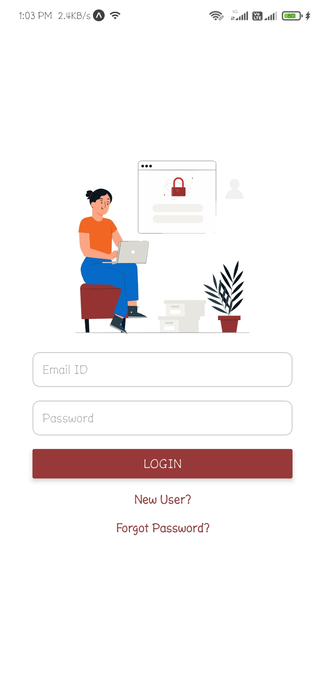
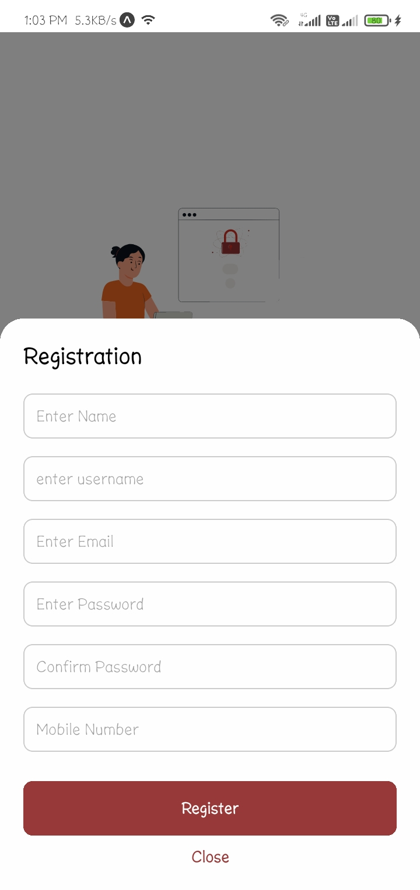
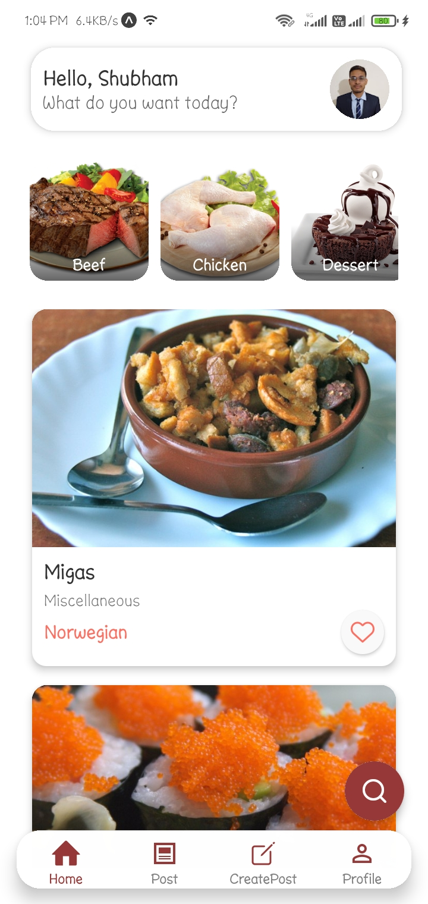
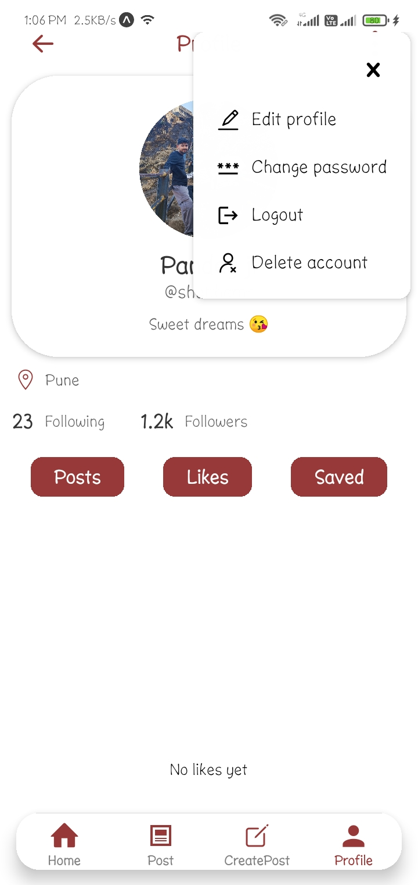
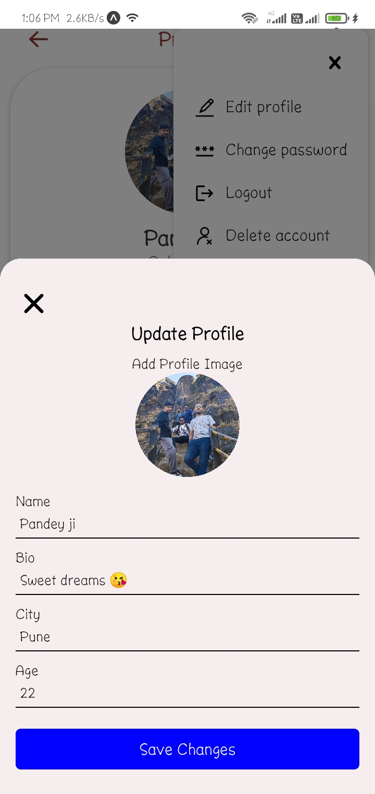
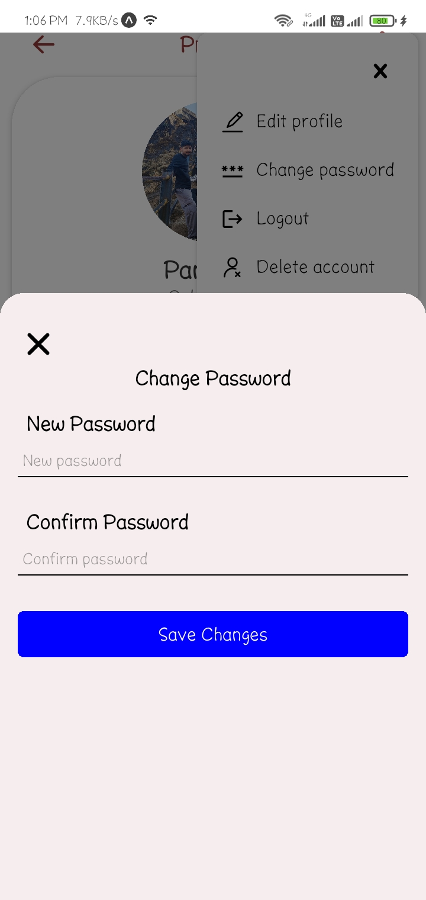
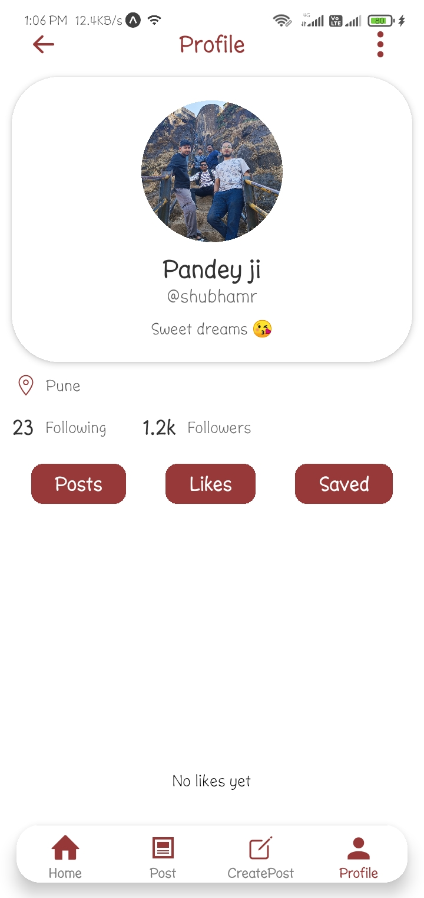
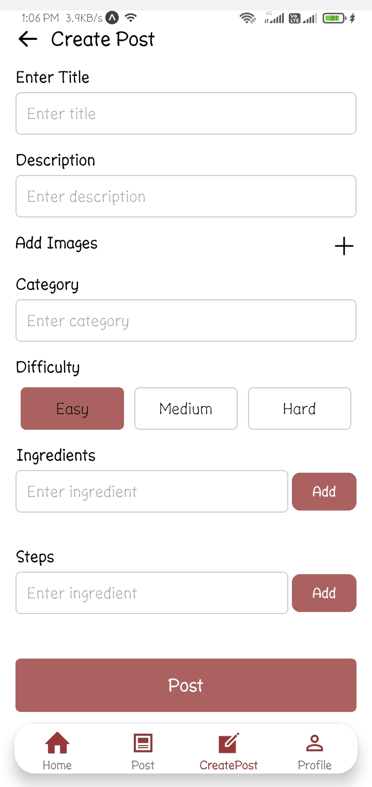
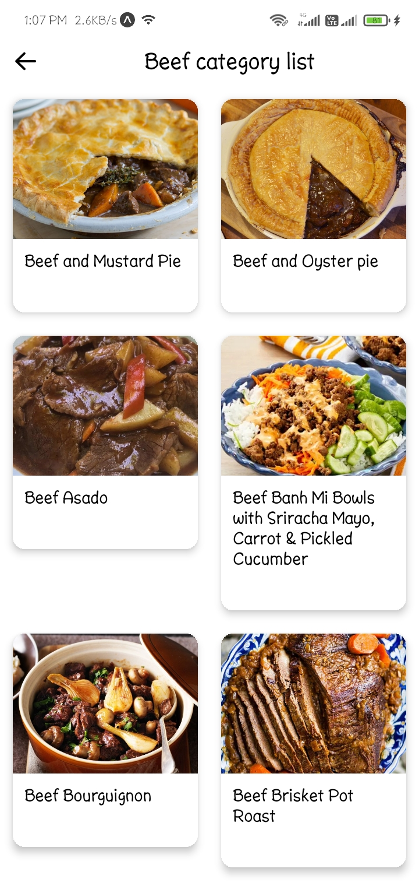
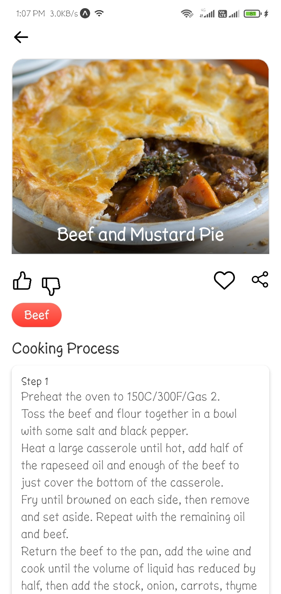

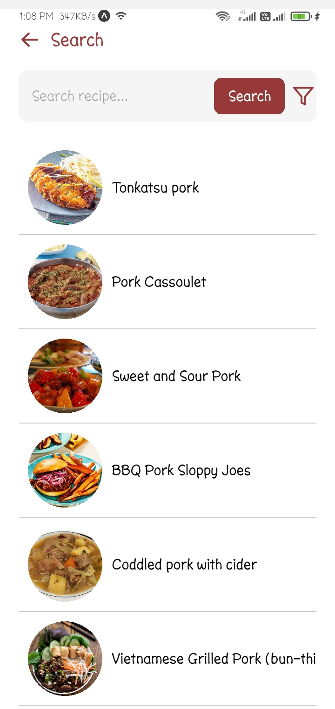

## 🛠️ Usage

1. Sign up or log in using Firebase authentication.
2. Search for recipes using ingredients or cuisine filters.
3. View recipe details, save favorites, and like recipes.
4. Share recipes with friends and family.

## 📬 Contact
For queries or collaboration, reach out:
- 📧 Email: shubhampandey8663@gmail.com
